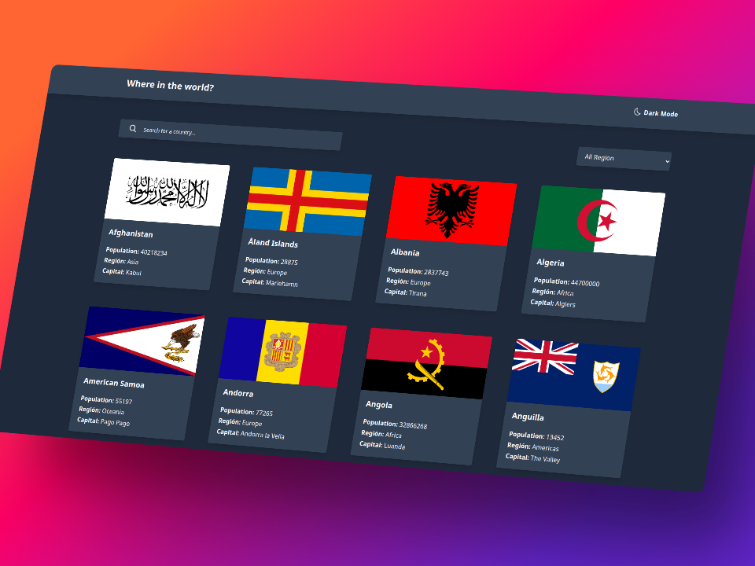

# Frontend Countries

This is a Frontend Mentor challenge where you can view all countries, search by name, filter by region, and see detailed information about each country. It also includes a dark mode.

## Technologies

- React
- Tailwind
- React Router Dom

## Run the Project

To run this project on your computer, follow these steps:

1. Clone the repository.
2. Open a terminal and navigate to the project's main folder.
3. Run `npm install` to install the dependencies.
4. Finally, run the following command `npm run dev` and go to the port indicated in the console.

